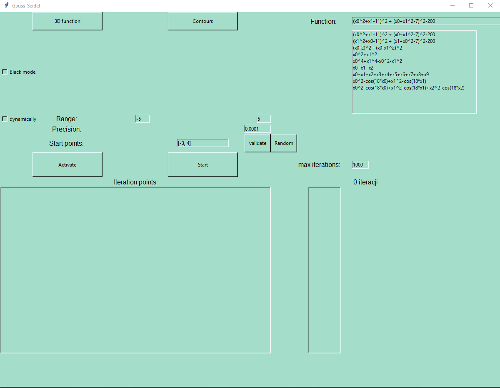
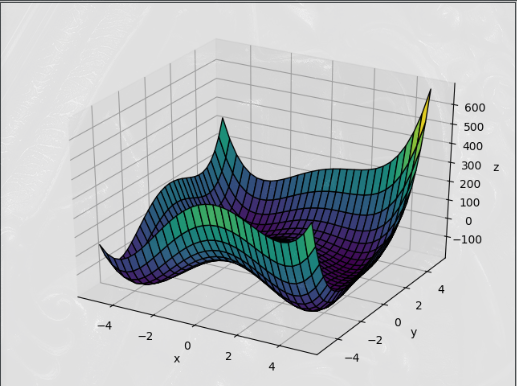
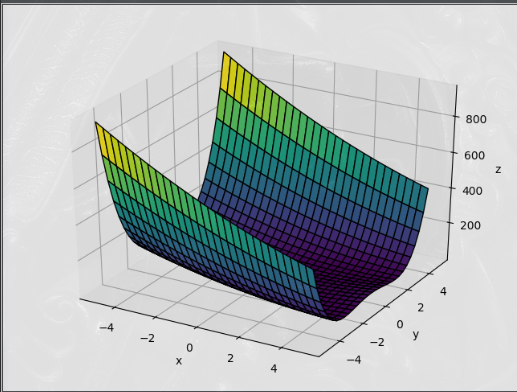
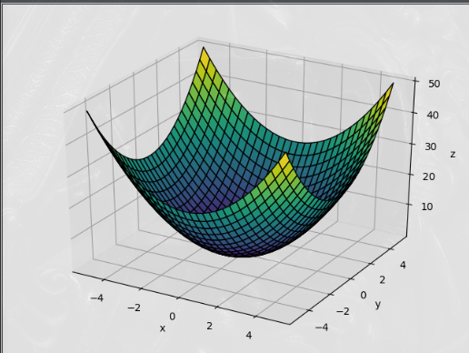
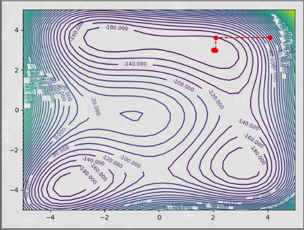
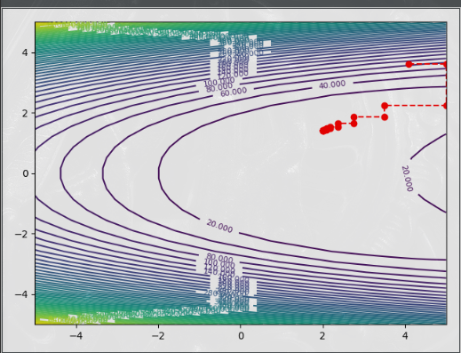
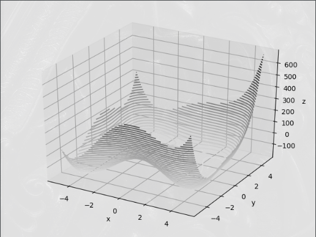

## General info
Optimization by Gauss-Seidel method. 

## Technologies
Project is created with:
* python3
* guizero
* tkinter
* matplotlib


## How to install?
```
pip3 install -r requirements.cfg
python3 parser.py
```

## Application view








